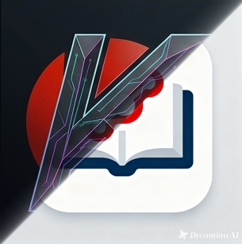

  
  <h1>🚀 Git Upload - 27NetTeam X RAIA RIKKEI</h1>
  
<b>Công cụ tự động hóa quá trình tạo Repository và đẩy Code lên GitHub chỉ với 1 Click!</b>

  
  
    

## 🌟 Giới thiệu Dự án

**Git Upload** là một nền tảng Web App được thiết kế nhằm mục đích tự động hóa và tối giản hóa quy trình nộp bài tập, đẩy code lên GitHub dành riêng cho các học viên của hệ thống **RAIA RIKKEI**.

Thay vì phải mở terminal, cài đặt Git và gõ hàng loạt câu lệnh rườm rà (`git add`, `git commit`, `git push`...) cho từng file, giờ đây bạn chỉ cần **kéo thả thư mục**, hệ thống sẽ tự động quét qua từng file bài tập và tạo ra một Repository riêng biệt trên GitHub cho mỗi file đó hoàn toàn tự động!

  

 

## ✨ Tính năng Nổi bật

<table width="100%">
  <tr>
    <td width="50%">
      <h3>💻 Chế độ: MỖI FILE = 1 REPO</h3>
      
Thấu hiểu quy trình nộp bài, công cụ sẽ tự động chẻ nhỏ thư mục của bạn ra, biến từng file `.py`, `.html` bên trong thành một Repository độc lập, tự động đặt tên theo file cực kỳ thông minh.

    </td>
    <td width="50%">
      <h3>☁️ Hoạt động 100% bằng REST API</h3>
      
Sử dụng GitHub REST API v3 để mã hóa file sang định dạng Base64 và tạo Blob, Tree, Commit trực tiếp từ Trình duyệt. Bạn hoàn toàn <b>không cần cài đặt Git</b> trên máy tính!

    </td>
  </tr>
  <tr>
    <td>
      <h3>🎨 Giao diện Cyberpunk / Neon</h3>
      
Tạm biệt những công cụ khô khan! Trải nghiệm thiết kế đỉnh cao với phong cách Glassmorphism trong suốt, viền phát sáng Neon, và hiệu ứng không gian 3D bồng bềnh.

    </td>
    <td>
      <h3>🔒 Bảo mật Local Storage</h3>
      
Thông tin nhạy cảm như mã PAT (Personal Access Token) và Username của bạn chỉ được lưu trữ an toàn ngay tại cục bộ trình duyệt (Local Storage), tuyệt đối không gửi lên server trung gian nào.

    </td>
  </tr>
</table>

## 🛠️ Hướng dẫn Cài đặt & Sử dụng

### Bước 1: Lấy mã Token (PAT) từ GitHub
1. Đăng nhập vào GitHub, truy cập góc phải trên cùng và chọn **Settings** > **Developer settings** > **Personal access tokens (classic)**.
2. Bấm nút **Generate new token (classic)**.
3. Ở phần Select scopes, hãy tick chọn vào ô vuông **`repo`** (Cấp quyền đầy đủ thao tác với các kho lưu trữ).
4. Cuộn xuống dưới cùng bấm Generate, và copy đoạn mã token vừa sinh ra (bắt đầu bằng `ghp_...`).

### Bước 2: Thao tác trên Giao diện Web
1. Bấm nút **Tài khoản** (Góc trên bên phải) để mở thanh cấu hình.
2. Nhập **Username** và **PAT** vừa lấy được.
3. Click hoặc Kéo thả thư mục bài tập của bạn vào khu vực đứt nét **Chọn thư mục**.
4. *(Tùy chọn)* Nhập tiền tố cho repo (VD: `btvn`) và bật/tắt công tắc chế độ Riêng tư (Private).
5. Bấm nút màu xanh **🌸 Bắt đầu tạo & Đẩy code lên GitHub** và chiêm ngưỡng các dòng lệnh tự động chạy vèo vèo trong Terminal!

## 👨‍💻 Giới thiệu Tác giả

  
  <h3>Nguyễn Như Hải Đăng</h3>
  
<b>Thành viên 27NetTeam - X-team RIKKEI</b> 
  Sinh viên lớp HN-KS25-CNTT5. Đam mê xây dựng các sản phẩm công nghệ tương lai, mang tính tự động hóa cao và tích hợp Trí tuệ nhân tạo (AI).

  
  
  

## ❤️ Ủng hộ Dự án

Nếu bạn thấy công cụ này "cứu rỗi" hàng tá giờ đồng hồ ngồi gõ lệnh Git và giúp quá trình học tập tại RIKKEI trở nên thú vị hơn, hãy nhấn sao ⭐️ cho dự án hoặc mời tác giả một ly trà đá nhé!

  
  <h2 style="color: #ff69b4; margin-top: 10px;">VietinBank: 0983798171</h2>

---

<i>Phát triển với 💖 bởi 27NetTeam (2026)</i>

